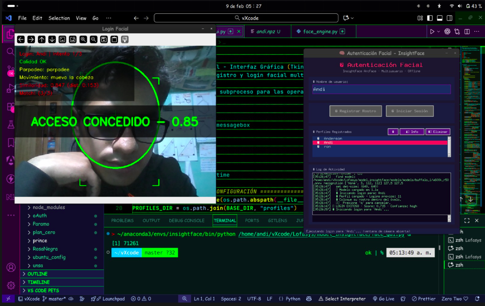

<p align="center">
  
</p>

<h1 align="center">🧠 Sistema de Autenticación Facial</h1>
<h4 align="center">InsightFace ArcFace · Visión por Computadora · Jupyter Notebook</h4>

<p align="center">
  
  
  
  
  
  
  
</p>

<p align="center">
  Aplicación de visión por computadora para autenticación facial biométrica multiusuario.<br>
  Registro de rostros, verificación de identidad 1:1 y detección de liveness — todo offline.
</p>

---

## 📋 Datos del Proyecto

| Campo                   | Detalle                                                                                          |
| ----------------------- | ------------------------------------------------------------------------------------------------ |
| **Institución**         | SENATI — Servicio Nacional de Adiestramiento en Trabajo Industrial                               |
| **Programa**            | Prototipado de Aplicación de Inteligencia Artificial                                             |
| **Tipo de evaluación**  | Examen de Suficiencia Profesional                                                                |
| **Alumno**              | Anderson Quispe                                                                                  |
| **Tema del examen**     | Desarrollar una aplicación en Jupyter Notebook de visión por computadora, documentando a detalle |
| **Cumplimiento**        | ✅ 100% — App completa con registro facial, login biométrico, GUI Tkinter y documentación total  |
| **Fecha de desarrollo** | Febrero 2026                                                                                     |
| **Versión**             | 1.0.0                                                                                            |

> **Nota:** El presente proyecto fue desarrollado como trabajo final para el examen de suficiencia del programa de **Prototipado de Aplicación de Inteligencia Artificial** de SENATI. El requerimiento era construir una aplicación de **visión por computadora** en **Jupyter Notebook**, documentando a detalle cada paso del desarrollo desde la instalación del entorno hasta el producto final. Esta aplicación implementa un **sistema de autenticación facial biométrica** completo usando el modelo **InsightFace (ArcFace)**, capaz de registrar múltiples usuarios, verificar identidades en tiempo real con la cámara, detectar intentos de suplantación (anti-spoofing) y ofrecer una interfaz gráfica Tkinter para interacción intuitiva. Todo el procesamiento se realiza **localmente en CPU**, sin necesidad de internet ni servidores externos.

---

## 📑 Índice

- [Descripción General](#-descripción-general)
- [Características](#-características)
- [¿Cómo Funciona?](#-cómo-funciona)
- [Modelo de IA: InsightFace ArcFace](#-modelo-de-ia-insightface-arcface)
- [Arquitectura del Sistema](#-arquitectura-del-sistema)
- [Bloques del Notebook](#-bloques-del-notebook)
- [Estructura de Archivos](#-estructura-de-archivos)
- [Tecnologías Utilizadas](#️-tecnologías-utilizadas)
- [Requisitos del Sistema](#-requisitos-del-sistema)
- [Instalación Paso a Paso](#-instalación-paso-a-paso)
- [Ejecución](#-ejecución)
- [Interfaz Gráfica (Tkinter)](#️-interfaz-gráfica-tkinter)
- [Perfiles Biométricos](#-perfiles-biométricos)
- [Pipeline de Procesamiento](#-pipeline-de-procesamiento)
- [Umbrales y Configuración](#-umbrales-y-configuración)
- [Capturas de Pantalla](#-capturas-de-pantalla)
- [Licencia](#-licencia)
- [Contacto](#-contacto)

---

## 🎯 Descripción General

Este proyecto implementa un **sistema de autenticación facial biométrica** completo usando técnicas de **visión por computadora** e **inteligencia artificial**. La aplicación permite registrar el rostro de una persona, almacenar su identidad como un vector matemático (embedding) y posteriormente verificar si la persona frente a la cámara corresponde al perfil registrado.

### Finalidad

En un mundo donde la seguridad digital es cada vez más importante, la autenticación biométrica facial ofrece una alternativa rápida, segura y sin contraseñas. Este proyecto demuestra cómo implementar un sistema así usando herramientas de código abierto:

- 📷 **Registrar** rostros capturando múltiples frames con guía visual
- 🧬 **Generar** representaciones matemáticas únicas del rostro (embeddings 512D)
- 🔐 **Verificar** identidades comparando vectores en tiempo real
- 🛡️ **Detectar** intentos de fraude (fotos, pantallas) con liveness detection
- 👥 **Gestionar** múltiples usuarios de forma independiente
- 🖥️ **Interactuar** a través de una interfaz gráfica moderna

### ¿Por qué InsightFace?

- 🏆 **Estado del arte** en reconocimiento facial (LFW: 99.83% accuracy)
- 📐 **ArcFace loss** — margen angular aditivo para embeddings discriminativos
- 🔓 **Open source** y gratuito para uso académico
- 💻 **Funciona en CPU** — no requiere GPU
- 🌐 **100% offline** — sin envío de datos biométricos a la nube

---

## ✨ Características

### Funcionalidades Principales

| Característica             | Descripción                                                             |
| -------------------------- | ----------------------------------------------------------------------- |
| **Registro Facial**        | Captura 8-15 frames con guía visual (óvalo) y genera embedding promedio |
| **Login Biométrico**       | Verifica identidad en tiempo real comparando con perfil guardado        |
| **Liveness Detection**     | Detecta parpadeo y movimiento de cabeza para prevenir suplantación      |
| **Validación de Calidad**  | Verifica nitidez, iluminación, tamaño y centrado del rostro             |
| **Multiusuario**           | Cada persona tiene su perfil `.npz` independiente                       |
| **Aprendizaje Adaptativo** | El perfil se actualiza automáticamente tras cada login exitoso          |
| **GUI Tkinter**            | Interfaz gráfica completa con diseño oscuro premium                     |
| **Overlay Visual**         | HUD en tiempo real con óvalo guía, barra de progreso y mensajes         |

### Funcionalidades Técnicas

- ✅ Modelo preentrenado **buffalo_l** (ArcFace + detección + landmarks)
- ✅ Embeddings de **512 dimensiones** normalizados L2
- ✅ Comparación por **distancia coseno** (threshold configurable)
- ✅ **Bounding box estilizado** con esquinas y score de detección
- ✅ **Anti-spoofing** con Eye Aspect Ratio (EAR) y tracking de nariz
- ✅ Actualización adaptativa: $E_{nuevo} = \frac{E_{perfil} \cdot k + E_{actual}}{k + 1}$
- ✅ Ejecución vía **subprocess** para soporte completo de `cv2.imshow`
- ✅ Resultados en formato **JSON** para integración con otros sistemas
- ✅ Notebook con **25 celdas** (12 código + 13 markdown) documentadas

---

## 🔄 ¿Cómo Funciona?

### Proceso de Registro

```
┌─────────────────────────────────────────────────────────┐
│  1. El usuario escribe su nombre                        │
│  2. Se abre la cámara con un ÓVALO GUÍA                │
│  3. El sistema detecta el rostro (InsightFace)          │
│  4. Valida: nitidez, luz, tamaño, centrado              │
│  5. Verifica liveness (parpadeo + movimiento)           │
│  6. Captura 8-15 frames válidos (12 seg máx)            │
│  7. Calcula el EMBEDDING PROMEDIO (512D)                │
│  8. Guarda perfil en profiles/<usuario>.npz             │
└─────────────────────────────────────────────────────────┘
         Óvalo:  🔴 Rojo → 🟡 Amarillo → 🟢 Verde
```

### Proceso de Login

```
┌─────────────────────────────────────────────────────────┐
│  1. El usuario selecciona su nombre                     │
│  2. Se carga el embedding del perfil guardado           │
│  3. Se abre la cámara con óvalo guía                    │
│  4. Se genera embedding del rostro en vivo              │
│  5. Se calcula DISTANCIA COSENO vs perfil               │
│  6. Si dist < 0.45 por 3 frames → ✅ ACCESO CONCEDIDO  │
│  7. Se actualiza adaptativamente el perfil              │
│                                                         │
│  Score > 0.55 → ✅ Match (verde)                        │
│  Score 0.35-0.55 → 🔄 Zona gris (amarillo)             │
│  Score < 0.35 → ❌ No match (rojo)                      │
└─────────────────────────────────────────────────────────┘
```

---

## 🤖 Modelo de IA: InsightFace ArcFace

### ¿Qué es InsightFace?

**InsightFace** es un framework de código abierto para análisis facial profundo que incluye detección de rostros, alineación facial, reconocimiento y atributos. Fue desarrollado por el equipo de investigación de InsightFace y es ampliamente utilizado en la industria.

### ¿Qué es ArcFace?

**ArcFace** (Additive Angular Margin Loss) es una función de pérdida que mejora el poder discriminativo de los embeddings faciales añadiendo un margen angular en el espacio de features. Publicado en el paper _"ArcFace: Additive Angular Margin Loss for Deep Face Recognition"_ (Deng et al., 2019).

La función de pérdida ArcFace se define como:

$$L = -\frac{1}{N} \sum_{i=1}^{N} \log \frac{e^{s \cdot \cos(\theta_{y_i} + m)}}{e^{s \cdot \cos(\theta_{y_i} + m)} + \sum_{j=1, j \neq y_i}^{n} e^{s \cdot \cos\theta_j}}$$

Donde:

- $s$ = factor de escala (64.0)
- $m$ = margen angular aditivo (0.5 rad)
- $\theta_{y_i}$ = ángulo entre el feature y el peso de la clase correcta

### Modelo: buffalo_l

El modelo utilizado es **buffalo_l**, que contiene 5 sub-modelos ONNX:

| Sub-modelo       | Archivo          | Función                                                                     |
| ---------------- | ---------------- | --------------------------------------------------------------------------- |
| **Detector**     | `det_10g.onnx`   | Detección de rostros (RetinaFace)                                           |
| **Recognizer**   | `w600k_r50.onnx` | Embeddings faciales 512D (ArcFace ResNet50, entrenado con 600K identidades) |
| **Landmarks**    | `2d106det.onnx`  | 106 puntos de referencia facial                                             |
| **3D Landmarks** | `1k3d68.onnx`    | 68 puntos 3D del rostro                                                     |
| **Attributes**   | `genderage.onnx` | Estimación de género y edad                                                 |

### Especificaciones

| Característica             | Valor                                    |
| -------------------------- | ---------------------------------------- |
| **Framework**              | InsightFace 0.7.3                        |
| **Arquitectura**           | ArcFace (ResNet50)                       |
| **Datos de entrenamiento** | 600K identidades (~12M imágenes)         |
| **Dimensión embedding**    | 512 valores float32                      |
| **Precisión (LFW)**        | 99.83%                                   |
| **Tamaño del modelo**      | ~326 MB (5 archivos ONNX)                |
| **Resolución detección**   | 640×640 píxeles                          |
| **Runtime**                | ONNX Runtime (CPU)                       |
| **Uso en este proyecto**   | Verificación 1:1 (no identificación 1:N) |

---

## 🏗 Arquitectura del Sistema

```
┌──────────────────────────────────────────────────────────────┐
│                    CAPA DE INTERFAZ                           │
│                                                              │
│  ┌──────────────┐  ┌──────────────┐  ┌──────────────────┐   │
│  │  Jupyter      │  │  Tkinter     │  │  Terminal         │   │
│  │  Notebook     │  │  GUI Premium │  │  face_engine.py   │   │
│  │  (25 celdas)  │  │  (face_gui)  │  │  CLI              │   │
│  └──────┬───────┘  └──────┬───────┘  └────────┬─────────┘   │
│         │                 │                    │              │
├─────────┴─────────────────┴────────────────────┴──────────────┤
│                    CAPA DE EJECUCIÓN                          │
│                                                              │
│  subprocess.run() → face_engine.py → __RESULT_JSON__:{}      │
│  (Proceso externo con acceso completo a cv2.imshow)          │
│                                                              │
├──────────────────────────────────────────────────────────────┤
│                    MOTOR BIOMÉTRICO                           │
│                                                              │
│  ┌─────────┐  ┌──────────┐  ┌─────────┐  ┌──────────────┐  │
│  │ Cámara  │→│ Detección │→│ Calidad │→│ Liveness     │  │
│  │ OpenCV  │  │ RetinaFace│  │ Blur/Luz│  │ EAR+Movement │  │
│  └─────────┘  └──────────┘  └─────────┘  └──────────────┘  │
│                      │                          │            │
│                      ▼                          ▼            │
│  ┌──────────────────────────────────────────────────────┐    │
│  │  Generación de Embedding (ArcFace ResNet50 · 512D)   │    │
│  └──────────────────────┬───────────────────────────────┘    │
│                         │                                    │
│  ┌──────────────────────▼───────────────────────────────┐    │
│  │  Comparación: cosine_distance(embedding, perfil)     │    │
│  │  dist < 0.45 → ✅ Match  |  dist > 0.45 → ❌ Reject  │    │
│  └──────────────────────────────────────────────────────┘    │
│                                                              │
├──────────────────────────────────────────────────────────────┤
│                    ALMACENAMIENTO                             │
│                                                              │
│  profiles/<username>.npz                                     │
│  ├── embedding: numpy array float32 (512,)                   │
│  └── metadata: JSON {username, created, login_count, ...}    │
│                                                              │
│  models/models/buffalo_l/                                    │
│  ├── det_10g.onnx   (detector)                               │
│  ├── w600k_r50.onnx (recognizer)                             │
│  ├── 2d106det.onnx  (landmarks 2D)                           │
│  ├── 1k3d68.onnx    (landmarks 3D)                           │
│  └── genderage.onnx (atributos)                              │
└──────────────────────────────────────────────────────────────┘
```

### ¿Por qué subprocess?

El notebook de Jupyter ejecuta su kernel en un proceso aislado donde `cv2.imshow()` no funciona correctamente (OpenCV headless en el kernel). La solución arquitectónica es lanzar `face_engine.py` como **proceso externo** vía `subprocess`, que tiene acceso completo a la GUI del sistema operativo. El resultado se comunica de vuelta mediante JSON en stdout.

---

## 📓 Bloques del Notebook

El notebook `login_insightface.ipynb` está organizado en **12 bloques** temáticos (25 celdas):

| #   | Bloque                         | Tipo   | Descripción                                                     |
| --- | ------------------------------ | ------ | --------------------------------------------------------------- |
| 1   | **Imports y Configuración**    | Código | Carga de librerías, definición de umbrales y rutas              |
| 2   | **Cargar Modelo InsightFace**  | Código | Inicialización de buffalo_l con CPUExecutionProvider            |
| 3   | **Validación de Calidad**      | Código | Funciones: blur, brightness, face size, centered                |
| 4   | **Detección de Liveness**      | Código | Clase LivenessDetector con EAR y tracking de nariz              |
| 5   | **Gestión de Embeddings**      | Código | Save/load profiles, cosine similarity, actualización adaptativa |
| 6   | **Interfaz Visual (HUD)**      | Código | Óvalo guía, bounding box, panel de estado, barra de progreso    |
| 7   | **Registro Facial**            | Código | Función register_face() con captura multi-frame                 |
| 8   | **Login Facial**               | Código | Función login_face() con verificación 1:1 y score visual        |
| 9   | **Ejecutar Registro**          | Código | Lanza face_engine.py register via subprocess                    |
| 10  | **Ejecutar Login**             | Código | Lanza face_engine.py login via subprocess                       |
| 11  | **Utilidades**                 | Código | Listar, consultar info, eliminar perfiles                       |
| 12  | **Interfaz Gráfica (Tkinter)** | Código | GUI premium embebida con ~400 líneas de código                  |

Cada bloque tiene una **celda markdown** descriptiva seguida de la **celda de código**, siguiendo un flujo didáctico de lo básico a lo complejo.

---

## 📁 Estructura de Archivos

```
model_insightface/
│
├── login_insightface.ipynb     # 🎯 Notebook principal (25 celdas, ~1337 líneas)
├── face_engine.py              # ⚙️ Motor biométrico CLI (660 líneas)
├── face_gui.py                 # 🖥️ Interfaz Tkinter standalone (668 líneas)
├── image.png                   # 📸 Captura del producto terminado
├── README.md                   # 📄 Esta documentación
│
├── models/                     # 🤖 Modelos ONNX (~326 MB)
│   └── models/
│       └── buffalo_l/
│           ├── det_10g.onnx        # Detector de rostros (RetinaFace)
│           ├── w600k_r50.onnx      # Reconocimiento facial (ArcFace)
│           ├── 2d106det.onnx       # Landmarks 2D (106 puntos)
│           ├── 1k3d68.onnx         # Landmarks 3D (68 puntos)
│           └── genderage.onnx      # Género y edad
│
└── profiles/                   # 👤 Perfiles biométricos (.npz)
    ├── Andi.npz                    # Perfil de Andi
    ├── Anderson.npz                # Perfil de Anderson
    └── ron.npz                     # Perfil de Ron
```

### Descripción de Archivos

| Archivo                   | Líneas | Propósito                                                              |
| ------------------------- | ------ | ---------------------------------------------------------------------- |
| `login_insightface.ipynb` | ~1337  | Notebook completo con todo el desarrollo documentado paso a paso       |
| `face_engine.py`          | 660    | Motor biométrico ejecutable (register, login, info, list, delete, gui) |
| `face_gui.py`             | 668    | Interfaz gráfica Tkinter con diseño premium oscuro                     |
| `image.png`               | —      | Imagen referencial del producto terminado                              |

---

## 🛠️ Tecnologías Utilizadas

| Tecnología           | Versión  | Propósito                                                 |
| -------------------- | -------- | --------------------------------------------------------- |
| **Python**           | 3.10     | Lenguaje principal                                        |
| **Jupyter Notebook** | —        | Entorno de desarrollo interactivo                         |
| **Anaconda**         | 2024.10  | Gestor de entornos y paquetes                             |
| **InsightFace**      | 0.7.3    | Framework de análisis facial (detección + reconocimiento) |
| **ONNX Runtime**     | 1.23.2   | Inferencia de modelos ONNX en CPU                         |
| **OpenCV**           | 4.13.0   | Captura de cámara, procesamiento de imagen, GUI (imshow)  |
| **NumPy**            | 2.2.6    | Operaciones con vectores y matrices (embeddings)          |
| **Tkinter**          | Built-in | Interfaz gráfica de usuario                               |
| **VS Code**          | —        | Editor de código con extensión Jupyter                    |

### Stack de IA

```
InsightFace 0.7.3
├── RetinaFace (Detector)      → Localización de rostros
├── ArcFace ResNet50           → Generación de embeddings 512D
├── 2D Landmarks (106 pts)     → Puntos de referencia facial
├── 3D Landmarks (68 pts)      → Estructura 3D del rostro
└── Gender/Age                 → Estimación de atributos
         │
         ▼
    ONNX Runtime 1.23.2 (CPUExecutionProvider)
```

---

## 💻 Requisitos del Sistema

| Requisito             | Mínimo                         |
| --------------------- | ------------------------------ |
| **Sistema Operativo** | Ubuntu 22.04+ / Windows 10+    |
| **RAM**               | 4 GB (recomendado 8 GB)        |
| **Disco**             | ~1 GB (modelo + dependencias)  |
| **Cámara web**        | USB o integrada                |
| **CPU**               | x86_64 (Intel/AMD)             |
| **GPU**               | No requerida (funciona en CPU) |

---

## 🚀 Instalación Paso a Paso

### Paso 1: Instalar Anaconda

Anaconda es el gestor de entornos que usaremos para aislar las dependencias del proyecto.

```bash
# Descargar Anaconda (Linux)
wget https://repo.anaconda.com/archive/Anaconda3-2024.10-1-Linux-x86_64.sh

# Ejecutar el instalador
bash Anaconda3-2024.10-1-Linux-x86_64.sh

# Seguir las instrucciones:
# - Aceptar licencia (yes)
# - Directorio: ~/anaconda3 (Enter para default)
# - Inicializar conda (yes)

# Reiniciar terminal o ejecutar:
source ~/.bashrc    # o source ~/.zshrc si usas zsh

# Verificar instalación
conda --version     # Debería mostrar: conda 24.9.2
python --version    # Debería mostrar: Python 3.12.x
```

### Paso 2: Crear entorno Conda

Creamos un entorno dedicado con Python 3.10 (compatible con InsightFace):

```bash
# Crear entorno llamado 'insightface' con Python 3.10
conda create -n insightface python=3.10 -y

# Activar el entorno
conda activate insightface

# Verificar
python --version    # Python 3.10.x
```

### Paso 3: Instalar dependencias con pip

```bash
# Instalar InsightFace y ONNX Runtime
pip install insightface onnxruntime

# Instalar NumPy
pip install numpy
```

### Paso 4: Instalar OpenCV desde conda-forge

> ⚠️ **Importante:** Usamos el OpenCV de conda-forge (no pip) porque incluye soporte de GUI (Qt6) necesario para `cv2.imshow()`. La versión `opencv-python-headless` de pip NO muestra ventanas.

```bash
# Instalar OpenCV con soporte de GUI (Qt6)
conda install -c conda-forge opencv -y

# Verificar que funciona:
python -c "import cv2; print(cv2.__version__)"  # 4.13.0
```

### Paso 5: Clonar o copiar el proyecto

```bash
# Si tienes el repositorio:
cd /ruta/a/tu/workspace
git clone <url-del-repo>

# O simplemente copia la carpeta model_insightface/
```

### Paso 6: Descargar el modelo (automático)

La primera vez que ejecutes el Bloque 2 del notebook, InsightFace descargará automáticamente el modelo **buffalo_l** (~326 MB) en la carpeta `models/`. No necesitas hacer nada manual.

### Paso 7: Abrir y ejecutar el notebook

```bash
# Activar el entorno
conda activate insightface

# Abrir VS Code en el directorio del proyecto
code model_insightface/

# En VS Code:
# 1. Abrir login_insightface.ipynb
# 2. Seleccionar kernel: Python 3.10 (insightface)
# 3. Ejecutar las celdas en orden (Shift+Enter)
```

### Resumen de comandos de instalación

```bash
# === INSTALACIÓN COMPLETA (copiar y pegar) ===
conda create -n insightface python=3.10 -y
conda activate insightface
pip install insightface onnxruntime numpy
conda install -c conda-forge opencv -y
# Listo. Abrir el notebook y ejecutar.
```

---

## ▶️ Ejecución

### Método 1: Desde el Notebook (recomendado)

1. Abrir `login_insightface.ipynb` en VS Code
2. Seleccionar kernel `insightface` (Python 3.10)
3. Ejecutar celdas 1-11 en orden (definición de funciones)
4. Ejecutar celda 19 (Bloque 9) para **registrar** un rostro
5. Ejecutar celda 21 (Bloque 10) para **login** facial
6. Ejecutar celda 25 (Bloque 12) para abrir la **GUI Tkinter**

### Método 2: Desde terminal (CLI)

```bash
conda activate insightface
cd model_insightface/

# Registrar un usuario
python face_engine.py register <nombre>

# Hacer login
python face_engine.py login <nombre>

# Listar perfiles
python face_engine.py list

# Ver info de un perfil
python face_engine.py info <nombre>

# Eliminar perfil
python face_engine.py delete <nombre>

# Abrir interfaz gráfica
python face_engine.py gui
```

### Método 3: Interfaz gráfica directa

```bash
conda activate insightface
python face_gui.py
```

---

## 🖥️ Interfaz Gráfica (Tkinter)

La aplicación incluye una interfaz gráfica completa construida con Tkinter y diseño premium oscuro:

### Elementos de la Interfaz

| Elemento                | Descripción                                                    |
| ----------------------- | -------------------------------------------------------------- |
| **Logo animado**        | Icono circular violeta con silueta de rostro                   |
| **Campo de usuario**    | Input con placeholder, glow violeta al hacer focus             |
| **Botón Registrar**     | Violeta con hover effect — abre cámara para capturar rostro    |
| **Botón Login**         | Verde con hover effect — abre cámara para verificar            |
| **Lista de perfiles**   | Muestra todos los usuarios registrados (clic para seleccionar) |
| **Botones utilidad**    | Refresh, Info, Eliminar con mini-botones hover                 |
| **Log de actividad**    | Terminal estilo hacker con colores por tipo de mensaje         |
| **Indicador de estado** | Punto verde pulsante (listo) / naranja (procesando)            |
| **Barra gradiente**     | Decoración violeta→rosa que separa secciones                   |
| **Status bar**          | Información de estado en la parte inferior                     |

### Paleta de Colores

| Color      | Hex       | Uso                                  |
| ---------- | --------- | ------------------------------------ |
| Fondo      | `#0f0f1a` | Background principal (negro azulado) |
| Superficie | `#181830` | Cards y elementos elevados           |
| Acento     | `#6c63ff` | Botones, labels, bordes activos      |
| Éxito      | `#2ed573` | Login exitoso, indicador listo       |
| Error      | `#ff4757` | Login fallido, botón eliminar        |
| Warning    | `#ffa502` | Estado procesando                    |
| Texto      | `#e8e8f0` | Texto principal                      |

### Atajos

- **Enter** en el campo de usuario → Login rápido
- **Clic** en un perfil de la lista → Auto-fill del nombre
- **Q** durante la cámara → Cancelar operación

---

## 👤 Perfiles Biométricos

Cada usuario se almacena como un archivo `.npz` (formato comprimido de NumPy) con:

### Estructura del archivo `.npz`

```
profiles/<username>.npz
│
├── embedding: numpy.ndarray float32 (512,)
│   └── Vector normalizado L2 que representa el rostro
│
└── metadata: JSON string
    ├── username: str          # Nombre del usuario
    ├── created: str           # Fecha ISO de creación
    ├── num_captures: int      # Capturas usadas en registro
    ├── login_count: int       # Número de logins exitosos
    ├── last_login: str        # Último login exitoso
    └── update_weight: int     # Peso k para actualización (máx 20)
```

### Actualización Adaptativa

Tras cada login exitoso, el perfil se actualiza automáticamente para adaptarse a cambios graduales (corte de pelo, lentes, iluminación diferente):

$$E_{nuevo} = \frac{E_{perfil} \cdot k + E_{actual}}{k + 1}$$

Donde $k$ empieza en 5 y se incrementa hasta 20, dando cada vez más peso al perfil acumulado.

---

## ⚙️ Pipeline de Procesamiento

### Para cada frame de video:

```
Frame (640×480) → flip horizontal (espejo)
       │
       ▼
┌─────────────────────────┐
│ face_app.get(frame)     │  ← InsightFace: detecta rostros
│ Retorna: bbox, kps,     │     landmarks, embedding
│ embedding, det_score     │
└──────────┬──────────────┘
           │
     ┌─────┴─────┐
     │ ¿1 rostro? │
     └─────┬─────┘
           │ Sí
           ▼
┌─────────────────────────┐
│ Validación de Calidad   │
│ ├─ check_blur()         │  Laplacian variance ≥ 80
│ ├─ check_brightness()   │  50 ≤ brightness ≤ 200
│ ├─ check_face_size()    │  face_area ≥ 8% frame
│ └─ check_face_centered()│  dx,dy < 25% frame
└──────────┬──────────────┘
           │ OK
           ▼
┌─────────────────────────┐
│ Liveness Detection      │
│ ├─ EAR (Eye Aspect      │  Detecta parpadeo
│ │   Ratio)              │
│ └─ Nose tracking        │  Detecta movimiento
└──────────┬──────────────┘
           │ Alive
           ▼
┌─────────────────────────┐
│ REGISTRO: Guardar emb.  │  → profiles/<user>.npz
│ LOGIN: cosine_distance  │  → match si dist < 0.45
└─────────────────────────┘
```

---

## 📊 Umbrales y Configuración

Todos los umbrales son configurables en el Bloque 1 del notebook y en `face_engine.py`:

### Calidad de Imagen

| Parámetro          | Valor | Descripción                            |
| ------------------ | ----- | -------------------------------------- |
| `BLUR_THRESHOLD`   | 80.0  | Varianza Laplaciana mínima (nitidez)   |
| `BRIGHTNESS_MIN`   | 50    | Brillo mínimo del rostro (0-255)       |
| `BRIGHTNESS_MAX`   | 200   | Brillo máximo del rostro (0-255)       |
| `MIN_FACE_RATIO`   | 0.08  | Tamaño mínimo del rostro vs frame (8%) |
| `CENTER_TOLERANCE` | 0.25  | Tolerancia de centrado (25% del frame) |

### Similaridad

| Parámetro            | Valor | Descripción                        |
| -------------------- | ----- | ---------------------------------- |
| `MATCH_THRESHOLD`    | 0.45  | Distancia coseno máxima para match |
| `GRAY_ZONE_MIN`      | 0.35  | Inicio de la zona de incertidumbre |
| `MAX_LOGIN_ATTEMPTS` | 3     | Intentos antes de bloqueo temporal |

### Registro

| Parámetro          | Valor | Descripción                          |
| ------------------ | ----- | ------------------------------------ |
| `MIN_CAPTURES`     | 8     | Capturas mínimas para crear perfil   |
| `MAX_CAPTURES`     | 15    | Capturas máximas                     |
| `REGISTER_TIMEOUT` | 12    | Tiempo máximo de registro (segundos) |
| `CAPTURE_INTERVAL` | 0.4   | Segundos entre capturas válidas      |

### Cámara

| Parámetro       | Valor | Descripción      |
| --------------- | ----- | ---------------- |
| `CAMERA_WIDTH`  | 640   | Ancho de captura |
| `CAMERA_HEIGHT` | 480   | Alto de captura  |

---

## 📸 Capturas de Pantalla

### Interfaz Gráfica Tkinter (Producto Final)

<p align="center">
  
</p>

### Proceso Visual en Cámara

| Registro                                             | Login                                              |
| ---------------------------------------------------- | -------------------------------------------------- |
| Óvalo guía + barra de progreso + mensajes de calidad | Óvalo guía + score de similaridad + barra de score |
| 🔴→🟡→🟢 según validación                            | 🔴→🟡→🟢 según match con perfil                    |

### Flujo Completo

```
┌─────────────┐   ┌─────────────┐   ┌──────────────┐   ┌─────────────┐
│  Abrir GUI  │ → │  Escribir   │ → │  Registrar / │ → │  Resultado  │
│  Tkinter    │   │  nombre     │   │  Login       │   │  ✅ / ❌     │
└─────────────┘   └─────────────┘   └──────────────┘   └─────────────┘
```

---

## 📄 Licencia

Este proyecto está bajo la licencia **MIT**.

```
MIT License

Copyright (c) 2026 Anderson Quispe (Andiquis)

Permission is hereby granted, free of charge, to any person obtaining a copy
of this software and associated documentation files (the "Software"), to deal
in the Software without restriction, including without limitation the rights
to use, copy, modify, merge, publish, distribute, sublicense, and/or sell
copies of the Software, and to permit persons to whom the Software is
furnished to do so, subject to the following conditions:

The above copyright notice and this permission notice shall be included in all
copies or substantial portions of the Software.

THE SOFTWARE IS PROVIDED "AS IS", WITHOUT WARRANTY OF ANY KIND, EXPRESS OR
IMPLIED, INCLUDING BUT NOT LIMITED TO THE WARRANTIES OF MERCHANTABILITY,
FITNESS FOR A PARTICULAR PURPOSE AND NONINFRINGEMENT.
```

---

## 📬 Contacto

| Canal        | Enlace                                   |
| ------------ | ---------------------------------------- |
| **GitHub**   | [@Andiquis](https://github.com/Andiquis) |
| **Teléfono** | [942 287 756](tel:+51942287756)          |

---

<p align="center">
  <sub>Hecho con ❤️ por <strong>Anderson Quispe</strong> · SENATI 2026</sub><br>
  <sub>Examen de Suficiencia · Prototipado de Aplicación de Inteligencia Artificial</sub>
</p>
